# Lab 01 — Azure & Entra ID Setup + Security Investigation 🛡️☁️

**Platform:** Microsoft Azure / Microsoft Entra ID / Microsoft Defender XDR / Security Copilot  
**Focus:** Cloud environment setup, identity configuration, and incident investigation using Microsoft security tools  

---

## Objective

This lab demonstrates:

- Initial **Azure environment configuration** and cost governance
- **Microsoft Entra ID (Azure AD)** identity and access setup
- Provisioning and usage of **Microsoft Security Copilot**
- Performing a **SOC-style investigation** using Microsoft Defender XDR
- Applying **KQL-based threat hunting** and Copilot-assisted analysis

---

## Lab Environment

- Azure subscription (trial / personal tenant)
- Microsoft Entra ID tenant
- Microsoft Defender XDR
- Microsoft Security Copilot
- Simulated incident dataset

All activities were performed in an **isolated, non-production environment**.

---

# Part 1 — Azure Setup

## 1.1 Budget Creation

Configured a cost management budget to control Azure spending and prevent unexpected charges.

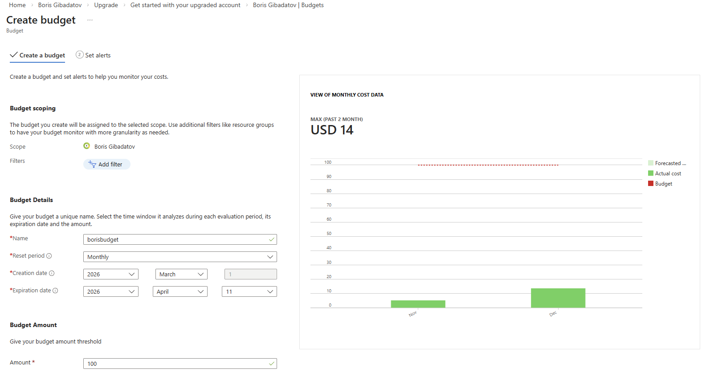

---

## 1.2 Alert Configuration

Set up budget alerts to trigger notifications when spending thresholds are reached.

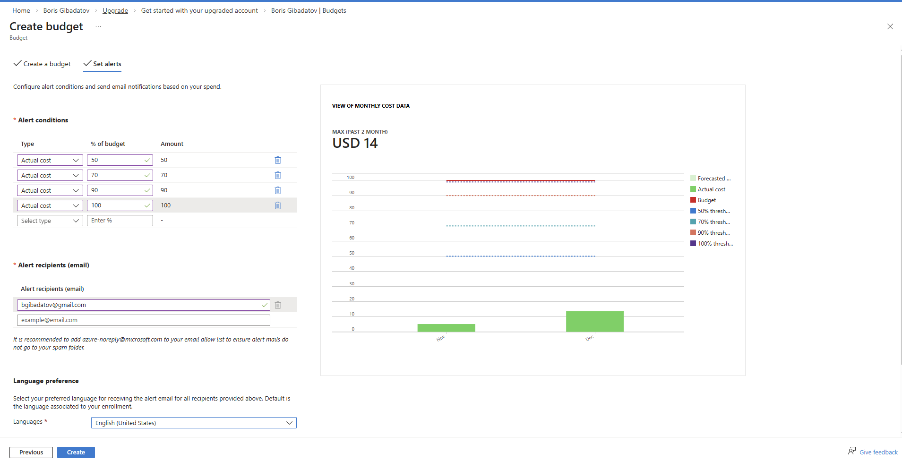

---

## 1.3 Resource Group Creation

Created a dedicated resource group to logically organize cloud resources used in the lab.

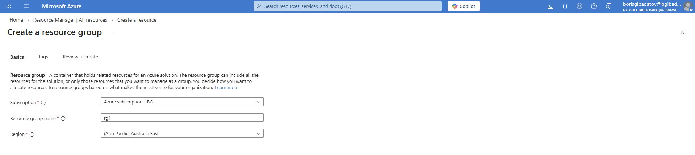

---

## 1.4 Log Analytics Workspace Creation

Provisioned a workspace to enable centralized logging and integration with security tools.

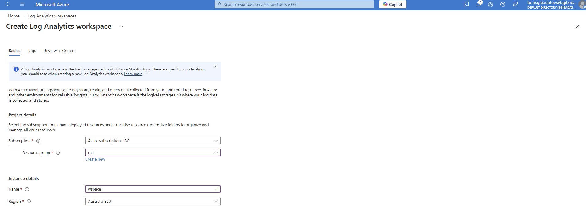

---

# Part 2 — Microsoft Entra ID Setup

## 2.1 Enabling Access to Azure Resources

Configured tenant settings to allow appropriate access across Azure services.

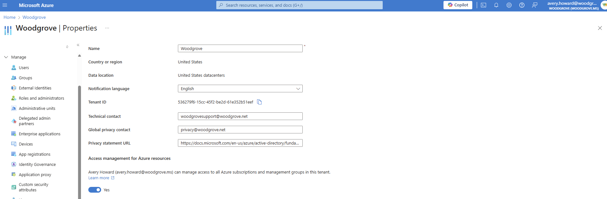

---

## 2.2 Assigning Owner Role

Assigned **Owner role** to the user to enable full administrative control for lab configuration.

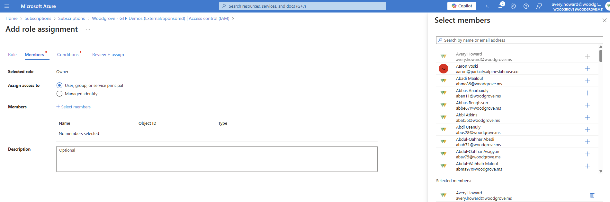

---

# Part 3 — Microsoft Security Copilot Setup

Provisioned Microsoft Security Copilot and verified its availability for investigation workflows.

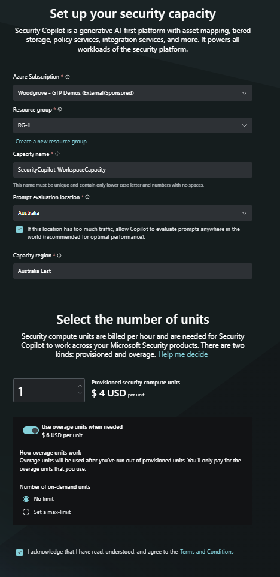

---

# Part 4 — Incident Investigation (Microsoft Defender XDR)

## 4.1 Incident Selection

Selected **high severity incident #185856** for investigation.

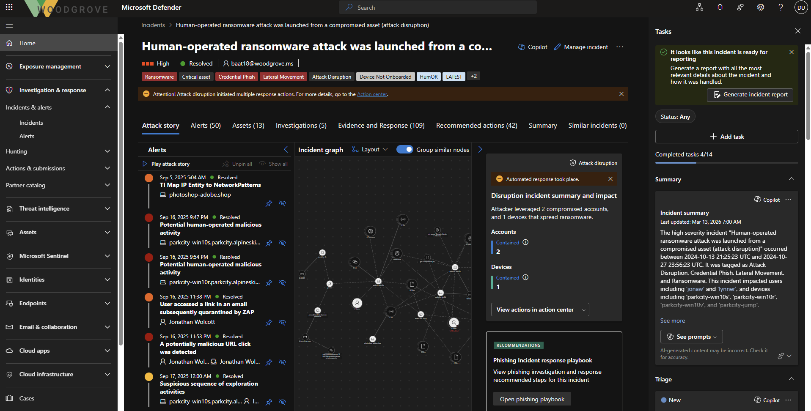

---

## 4.2 Suspicious RDP Investigation

Investigated suspicious Remote Desktop activity associated with the incident.

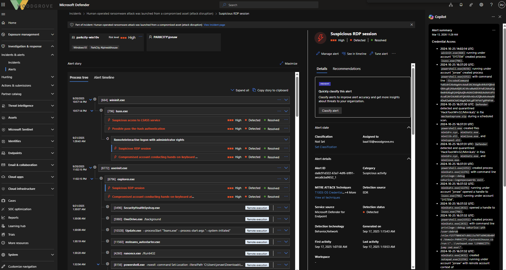

---

## 4.3 Device Summary (Copilot)

Used Security Copilot to generate a **summary of the affected device**, improving investigation speed.

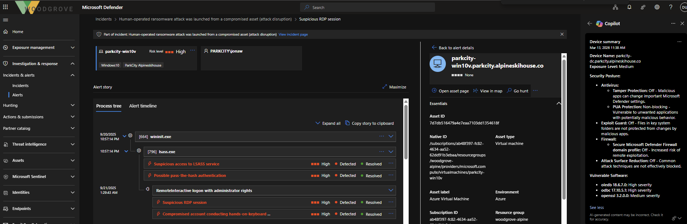

---

## 4.4 User Investigation

Analyzed details of the user associated with the compromised asset.

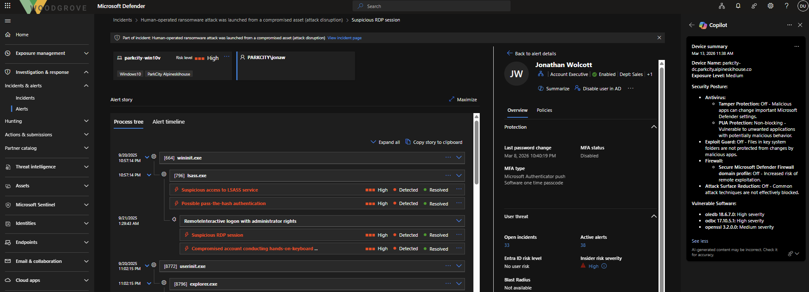

---

## 4.5 Suspicious Script Activity

Identified unexpected script execution originating from the user's device.

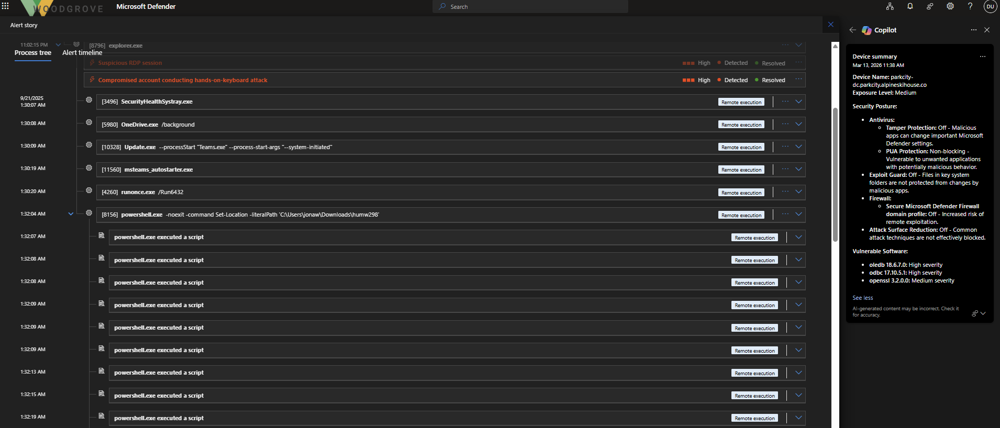

---

## 4.6 PowerShell Analysis (Base64 Decoding)

Decoded a suspicious PowerShell command to reveal underlying behavior.

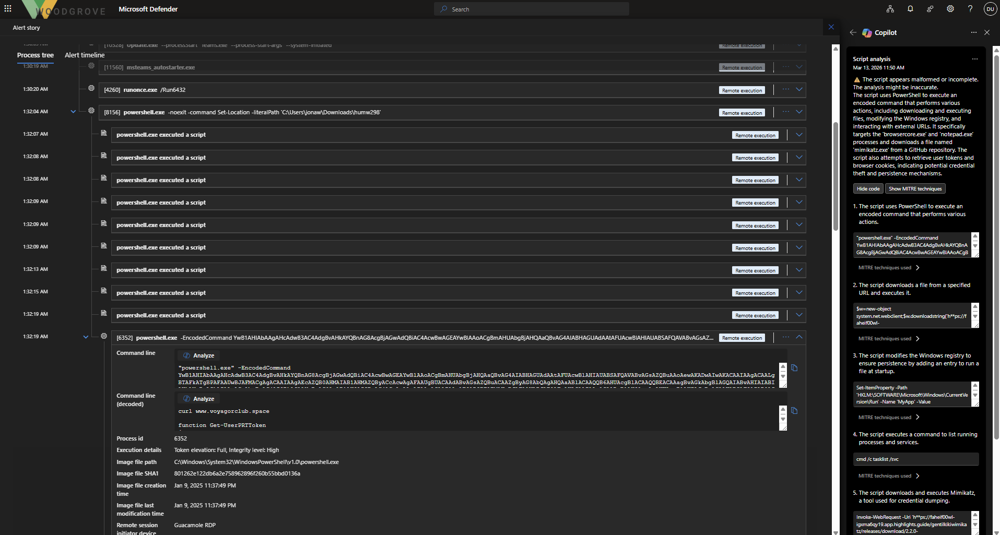

---

## 4.7 Artifact Investigation

Investigated related:

- Files  
- Processes  
- Emails  
- URLs  

to understand full attack scope.

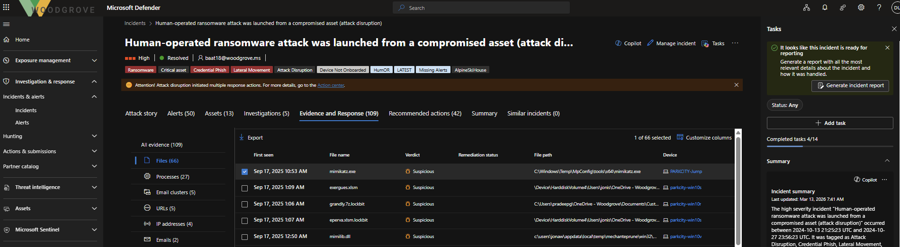

---

## 4.8 Mimikatz Detection

Detected usage of **mimikatz.exe**, indicating credential dumping activity.

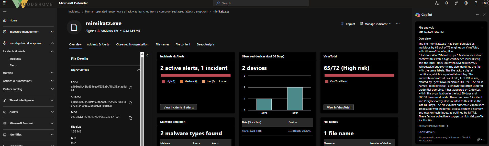

---

## 4.9 Copilot-Assisted Investigation

Used Security Copilot to enrich findings and accelerate analysis.

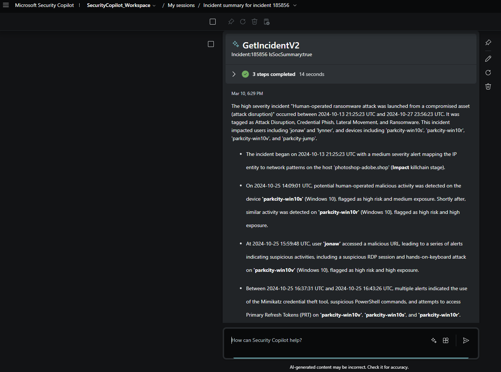

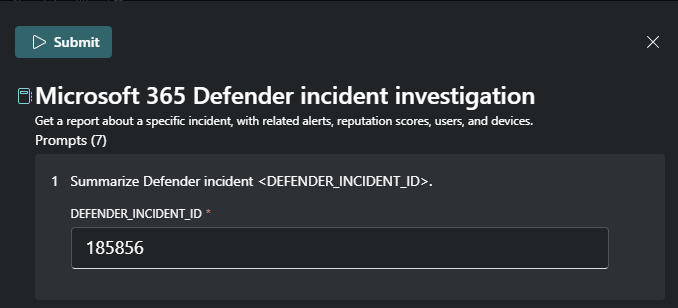

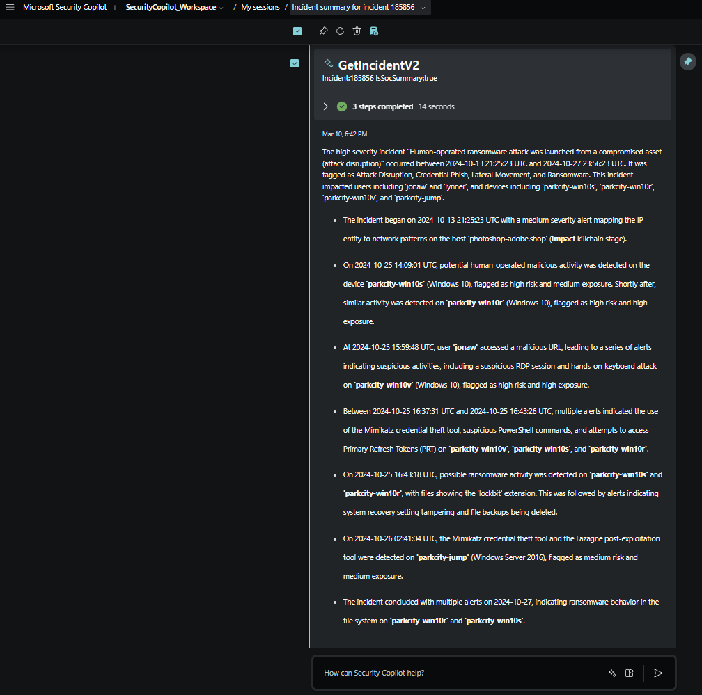

---

## 4.10 KQL Threat Hunting

Generated and executed **KQL queries** to identify additional malicious activity.

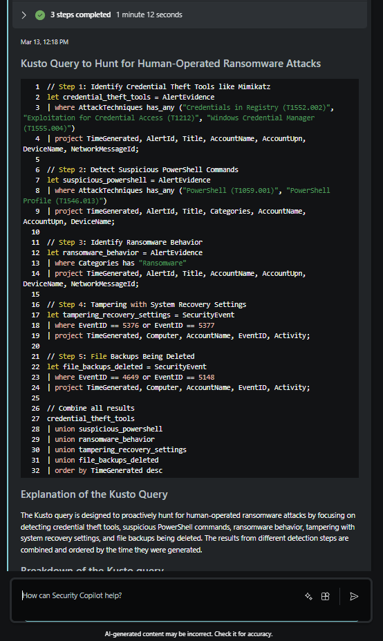

---

## 4.11 Additional Alerts Identified

Correlated additional alerts uncovered during advanced hunting.

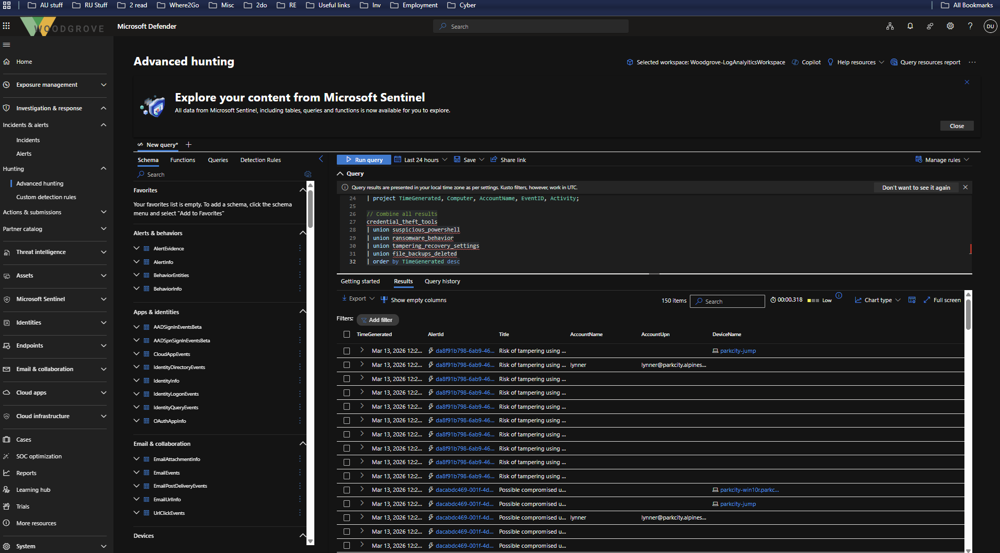

---

# Skills Demonstrated

- Azure cost management and resource organization
- Microsoft Entra ID role-based access control (RBAC)
- Microsoft Defender XDR investigation workflow
- Security Copilot usage for SOC efficiency
- KQL-based threat hunting
- Detection of:
  - Suspicious RDP activity
  - PowerShell abuse
  - Credential dumping (Mimikatz)

---

## Disclaimer

All activities were performed in a **controlled lab environment using simulated data**.
