# Lab 02 — Microsoft Defender for Endpoint (MDE) Investigation 🛡️💻

**Platform:** Microsoft Defender for Endpoint / Microsoft Defender XDR  
**Focus:** Endpoint onboarding, alert generation, incident investigation, and response  

---

## Objective

This lab demonstrates practical experience with **Microsoft Defender for Endpoint**, including:

- Onboarding endpoints into Defender
- Configuring roles and device groups
- Generating and analysing security alerts
- Investigating incidents using Defender XDR
- Understanding alert correlation and evidence collection

The lab simulates a **controlled attack scenario** and follows a structured SOC investigation workflow.

---

## Lab Environment

- Windows virtual machine onboarded to Defender
- Microsoft Defender portal
- Microsoft Entra ID (for RBAC and device grouping)
- Simulated attack scripts

All activities were performed in an **isolated, non-production environment**.

---

# Part 1 — Deployment of Microsoft Defender for Endpoint

## 1.1 Device Discovery

Initiated device discovery from the Defender portal to identify assets within the environment.

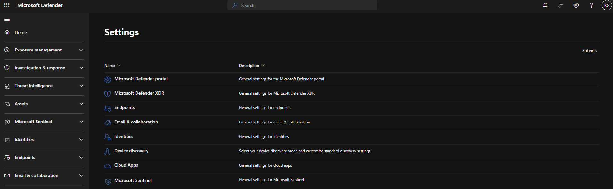

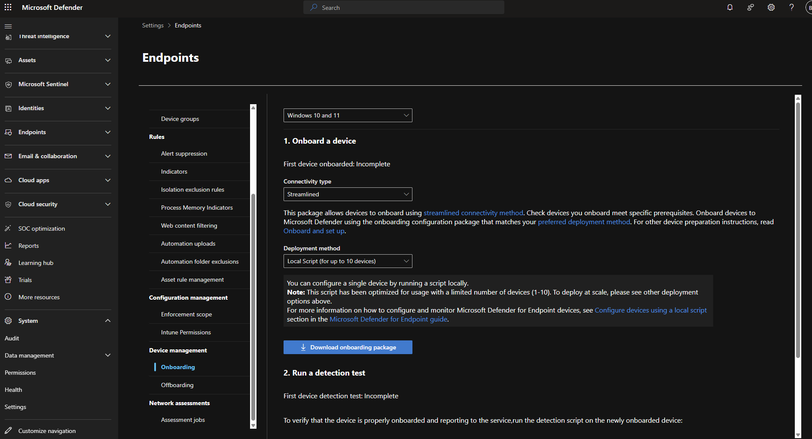

---

## 1.2 Endpoint Onboarding

Executed onboarding script on a virtual machine to connect the host to Defender for Endpoint.

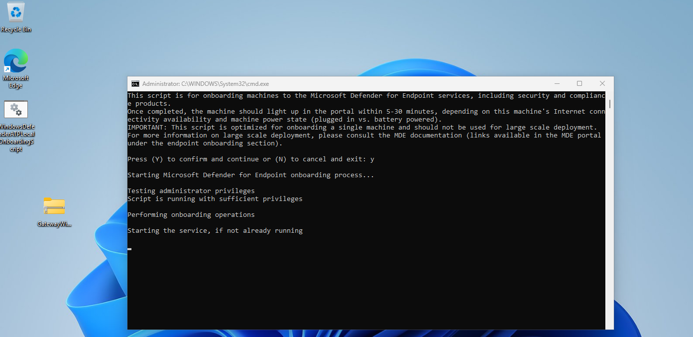

---

## 1.3 Onboarding Verification

Confirmed that the host was successfully onboarded and visible in the Defender portal.

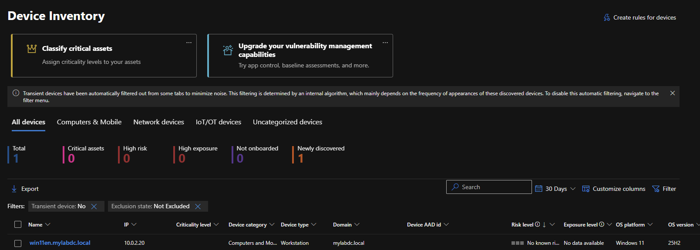

---

## 1.4 Alert Simulation

Executed a test script on the onboarded VM to generate security alerts.

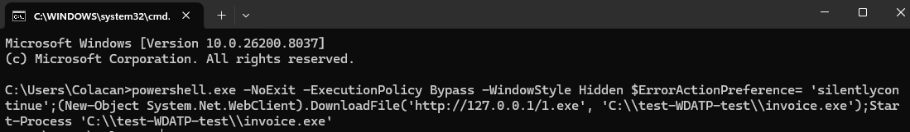

---

## 1.5 Alert Visibility

Verified that alerts generated from the test activity were successfully ingested into Defender.

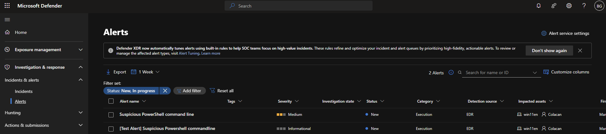

---

## 1.6 Role Configuration

Configured roles within the Defender portal to manage access and permissions.

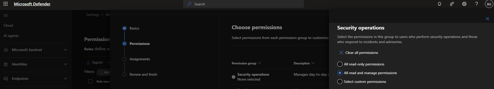

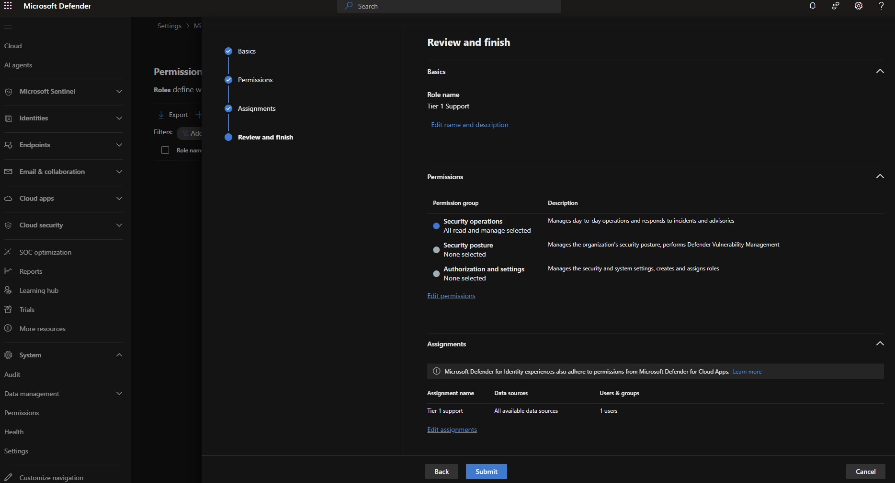

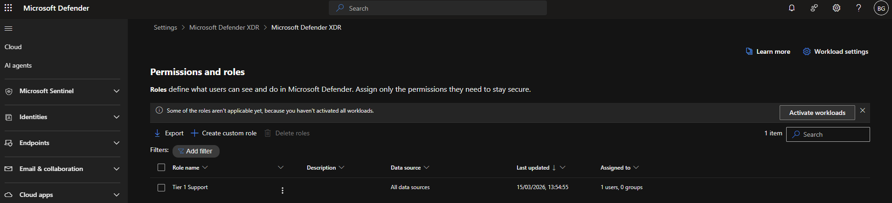

---

## 1.7 Entra ID Security Group

Created a security group in Microsoft Entra ID for role assignment and access control.

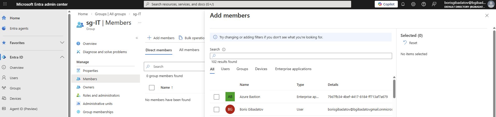

---

## 1.8 Device Group Configuration

Configured device groups to segment endpoints and apply policies.

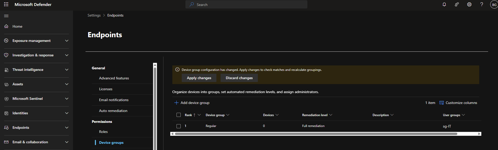

---

# Part 2 — Attack Detection & Mitigation

## 2.1 Alert Investigation

Opened and analysed the test alert generated during simulation.

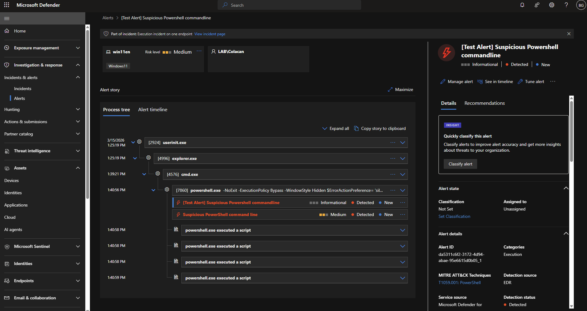

---

## 2.2 Incident Creation

Observed how Defender automatically correlates alerts into an incident.

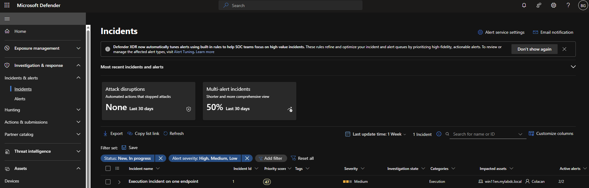

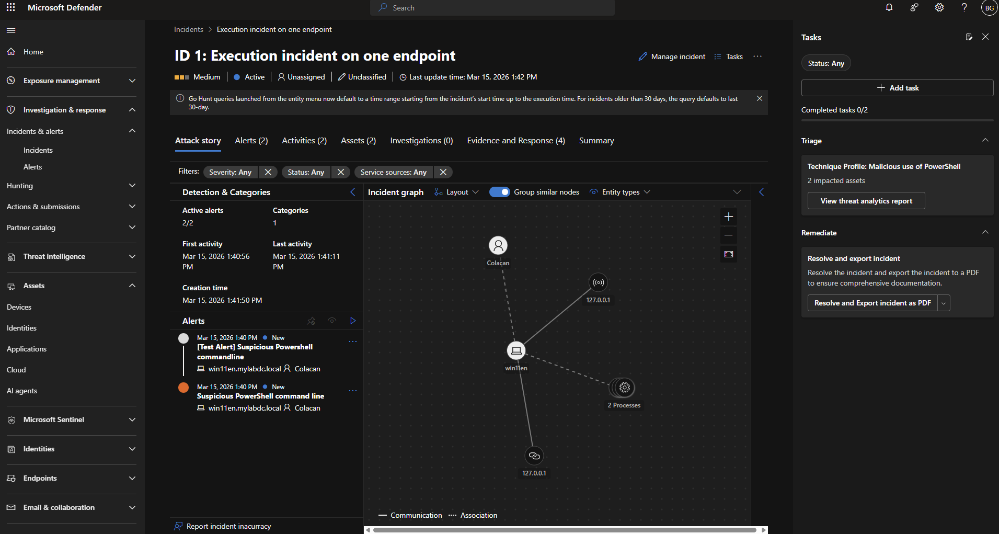

---

## 2.3 Incident Management

Reviewed incident details, severity, affected assets, and recommended actions.

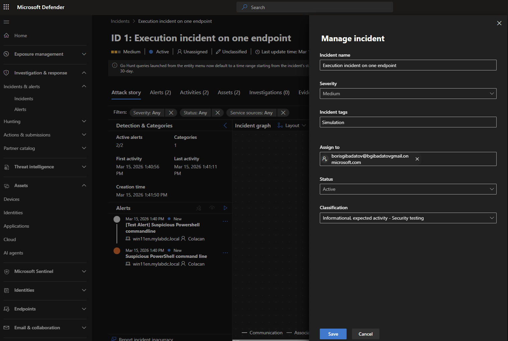

---

## 2.4 Additional Attack Simulation

Executed another attack script to generate additional suspicious activity.

---

## 2.5 Alert Correlation

Verified that multiple alerts were grouped into a single incident for investigation.

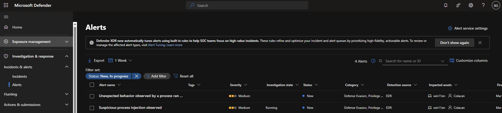

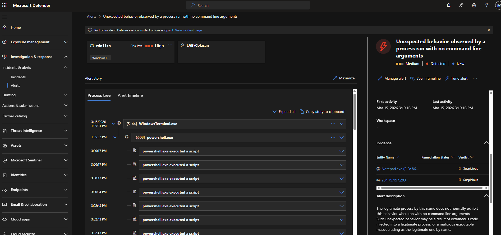

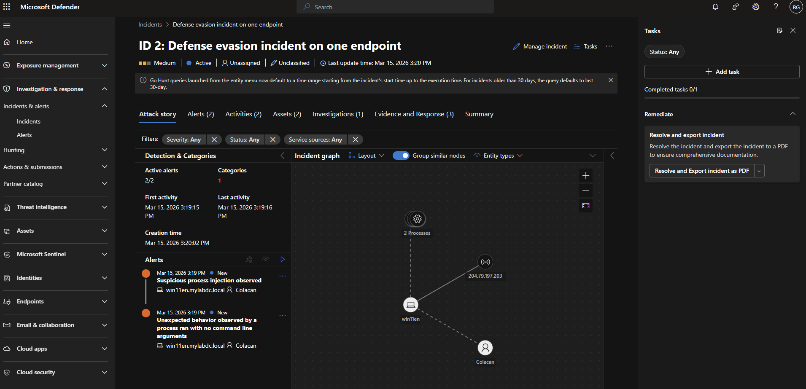

---

## 2.6 Evidence Collection

Reviewed collected evidence including:

- Processes  
- Files  
- User activity  
- Timeline of events  

to understand the attack chain.

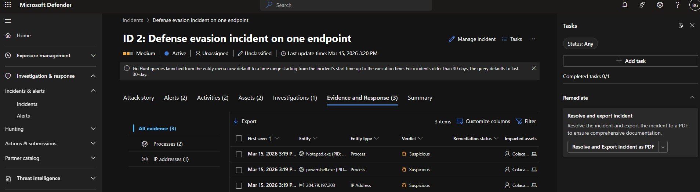

---

# Investigation Approach

The investigation followed a structured SOC methodology:

1. **Detection** — Alerts triggered by suspicious activity  
2. **Correlation** — Alerts grouped into incidents  
3. **Analysis** — Review of evidence and attack timeline  
4. **Response** — Identification of mitigation actions  

---

# Skills Demonstrated

- Endpoint onboarding and configuration (MDE)
- Role-based access control (RBAC) in Defender & Entra ID
- Alert analysis and incident triage
- Understanding Defender incident correlation logic
- Evidence-based investigation workflow
- Exposure to endpoint detection and response (EDR)

---

## Disclaimer

All activities were performed in a **controlled lab environment using simulated attack scenarios**.
