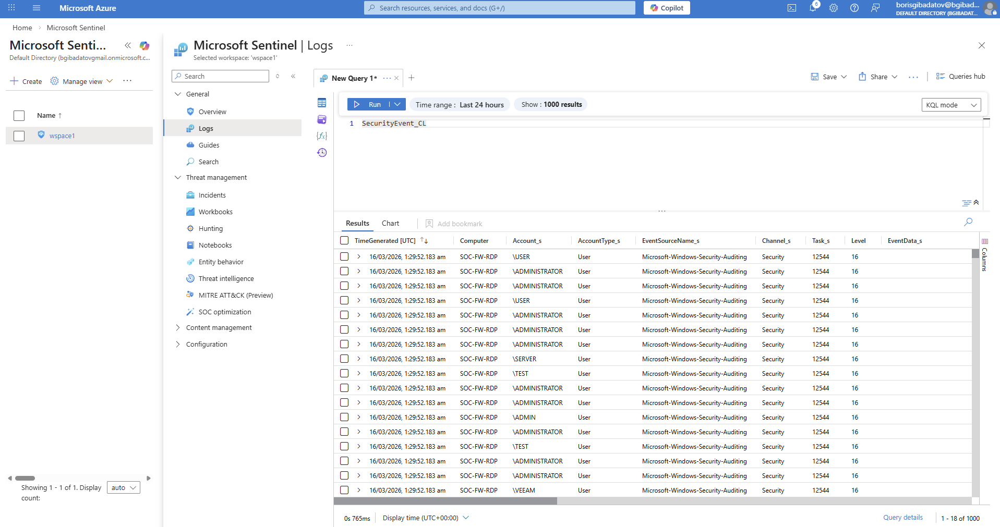
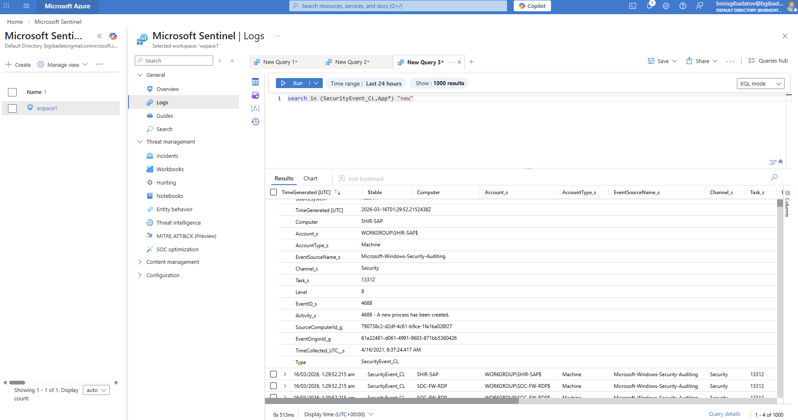
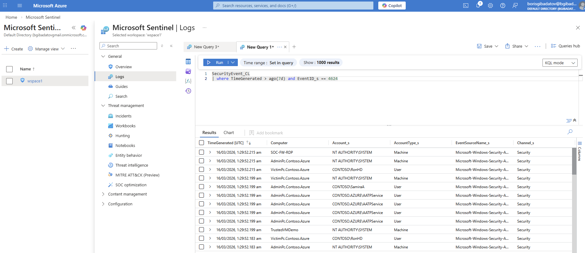
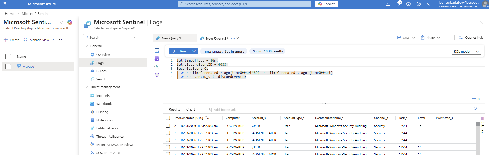
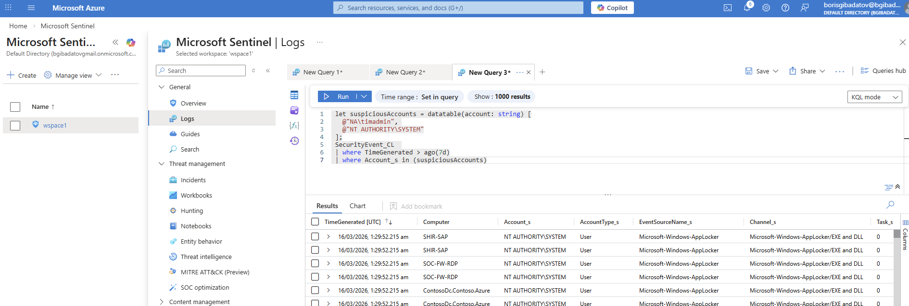
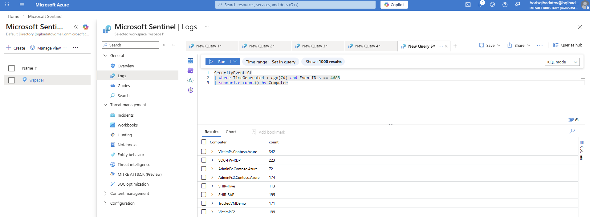
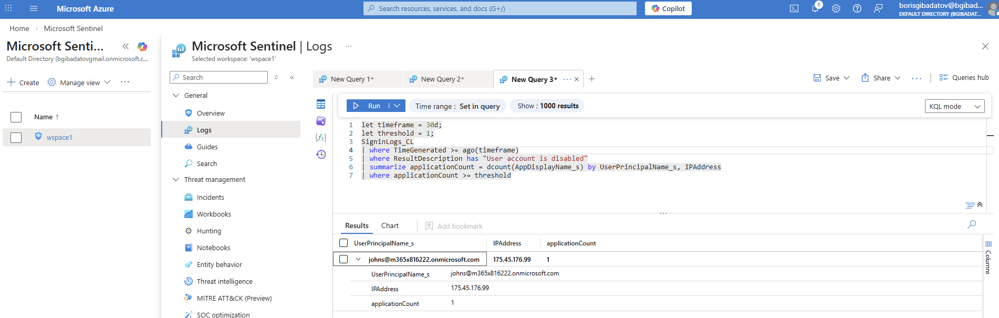
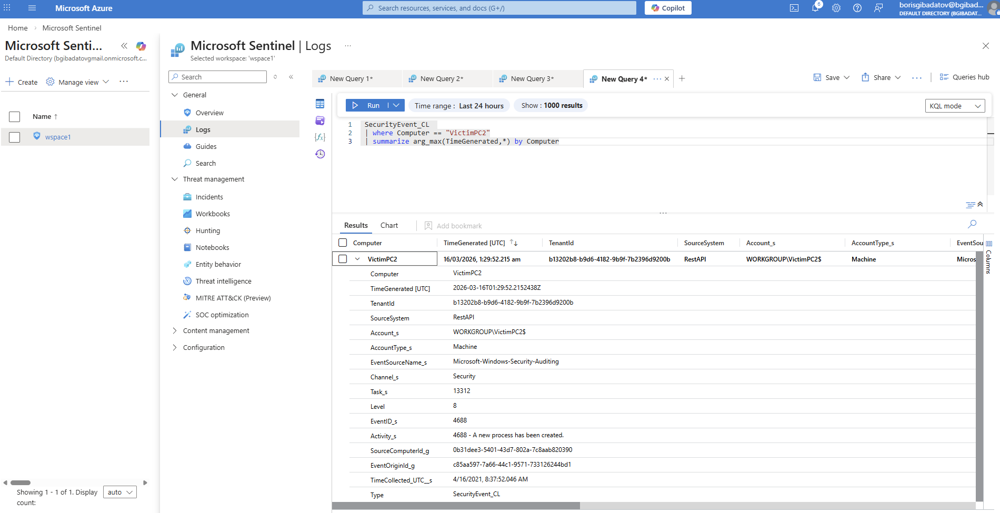
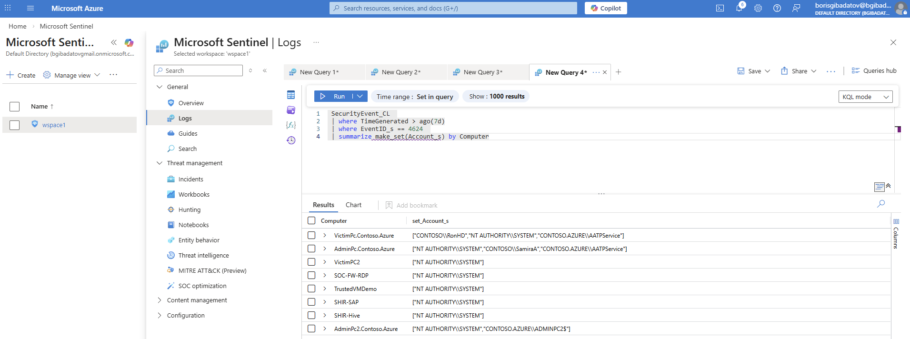
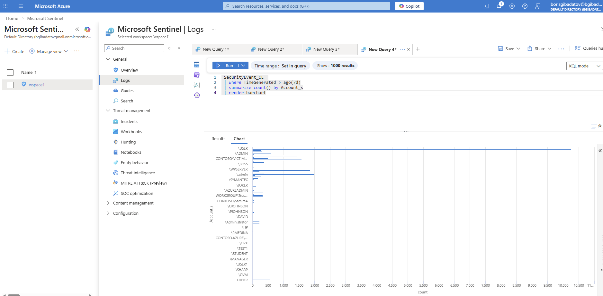

# Lab 04 — KQL Queries for Microsoft Sentinel 🔎📊

**Platform:** Microsoft Sentinel / Microsoft Defender XDR  
**Focus:** Log analysis, detection logic, and threat hunting using Kusto Query Language (KQL)

---

## Objective

This lab demonstrates practical use of **Kusto Query Language (KQL)** to:

- Query and filter security events
- Perform time-based analysis
- Detect suspicious activity patterns
- Aggregate and visualize data
- Build detection logic for SOC investigations

---

## Lab Environment

- Microsoft Sentinel workspace  
- SecurityEvent and custom tables  
- Simulated log dataset  

All activities were performed in a **controlled, non-production environment**.

---

## 1. Querying Custom Tables

Executed queries to retrieve data from custom tables and validate data ingestion.

---

## 2. Filtering Events by Keyword

Searched for events containing specific keywords within log descriptions.

---

## 3. Time-Based Filtering

Filtered events based on a defined timeframe (last 7 days).

---

## 4. Process Creation Filtering

Filtered events other than related to process creation activities within a defined timeframe.

---

## 5. Identifying Suspicious Accounts

Created a temporary list of accounts exhibiting suspicious activity and used it to filter related events.

---

## 6. Process Creation Analysis

Summarized process creation activity across accounts to identify anomalies.

---

## 7. Detection Rule Logic

Developed logic to detect repeated account disable failures across multiple systems.

---

## 8. Latest Event Retrieval

Queried the most recent event for a specific host.

---

## 9. User Activity Analysis

Generated a list of accounts logging into systems over a defined period.

---

## 10. Data Visualization

Rendered a bar chart to visualize event distribution across accounts.

---

# Investigation Value

These queries support:

- Rapid filtering of large datasets
- Detection of abnormal behaviour patterns
- Creation of detection rules
- Visualization of activity trends
- Efficient SOC investigation workflows

---

# Skills Demonstrated

- KQL query development
- Log filtering and aggregation
- Time-based analysis
- Threat hunting techniques
- Detection logic creation
- Data visualization in Sentinel

---

## Disclaimer

All activities were performed in a **controlled lab environment using simulated data**.
