# Lab 07 — Microsoft Purview (Data Protection & Insider Risk) 🔐📊

**Platform:** Microsoft Purview  
**Focus:** Data classification, DLP, sensitivity labels, and insider risk management  

---

## Lab Summary

This lab demonstrates implementation of **data protection and compliance controls** using Microsoft Purview.

The work includes:

- Defining custom sensitive information types  
- Creating sensitivity labels and auto-labeling policies  
- Implementing Data Loss Prevention (DLP) controls  
- Configuring insider risk management  
- Monitoring and detecting risky user behaviour  

This reflects real-world **data security and compliance scenarios** in enterprise environments.

---

## Objective

The goal of this lab is to:

- Classify sensitive organisational data  
- Apply automated protection controls  
- Prevent data leakage to external platforms  
- Detect and monitor insider risk activity  

---

## Lab Environment

- Microsoft 365 tenant (E5)  
- Microsoft Purview compliance portal  
- Test user accounts  
- Simulated sensitive data  

All activities were performed in a **controlled, non-production environment**.

---

# Part 1 — Role Configuration & Access

## 1.1 Compliance Administrator Role

Created a user account with Compliance Administrator role in Microsoft 365.

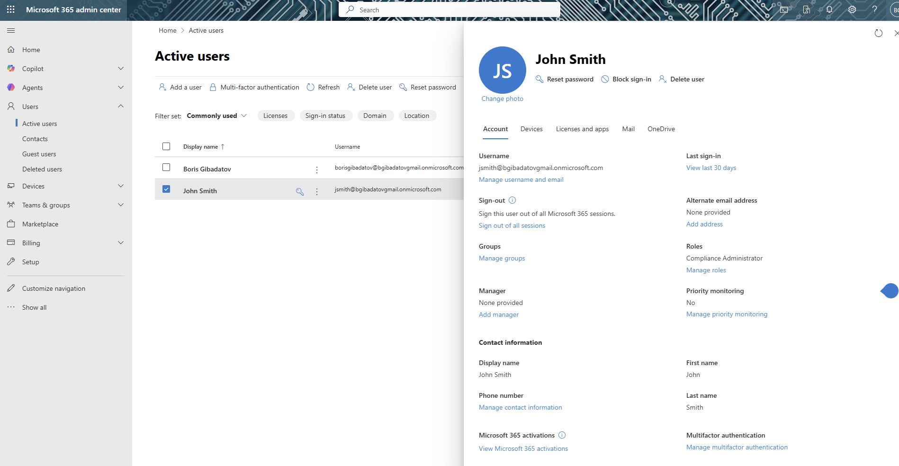

---

## 1.2 Accessing Microsoft Purview

Logged into Microsoft Purview portal using assigned account.

---

# Part 2 — Data Classification

## 2.1 Custom Sensitive Information Type

Created a custom sensitive information type (Employee ID).

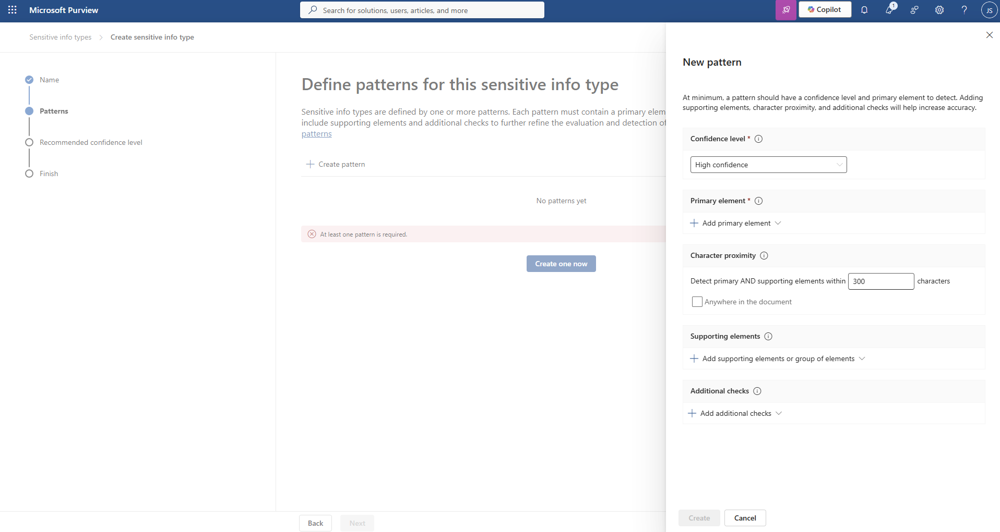

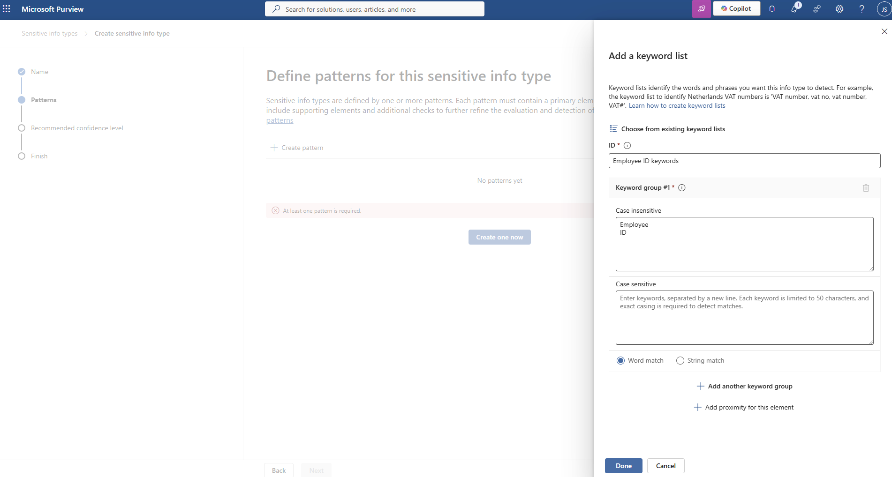

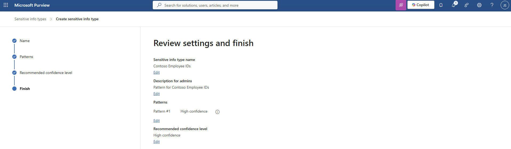

---

## 2.2 Sensitive Data Identification

Configured detection logic using multiple conditions.

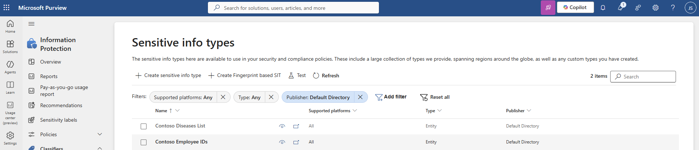

---

## 2.3 Testing Classification

Validated detection of sensitive data using test inputs.

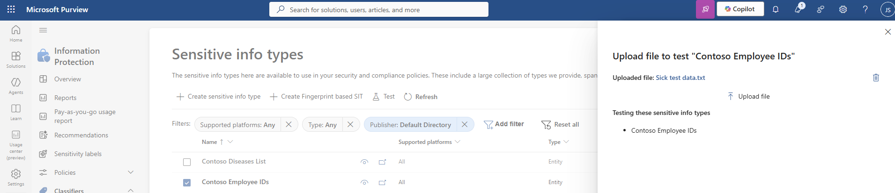

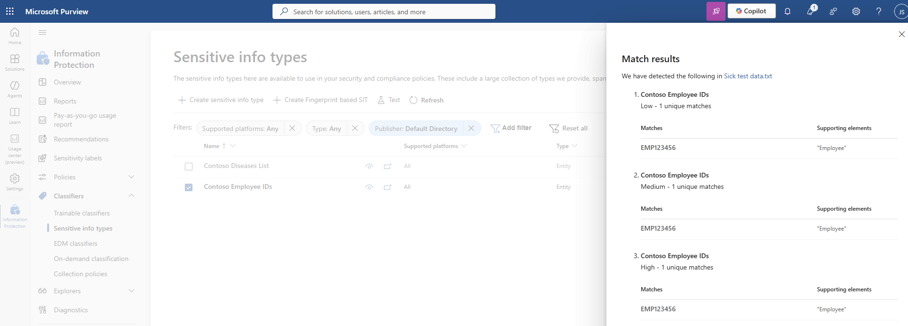

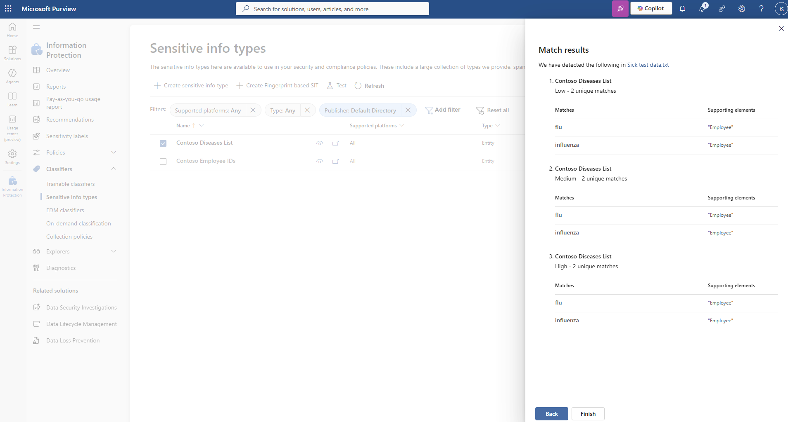

---

# Part 3 — Sensitivity Labels

## 3.1 Creating Sensitivity Label

Defined a custom sensitivity label for data classification.

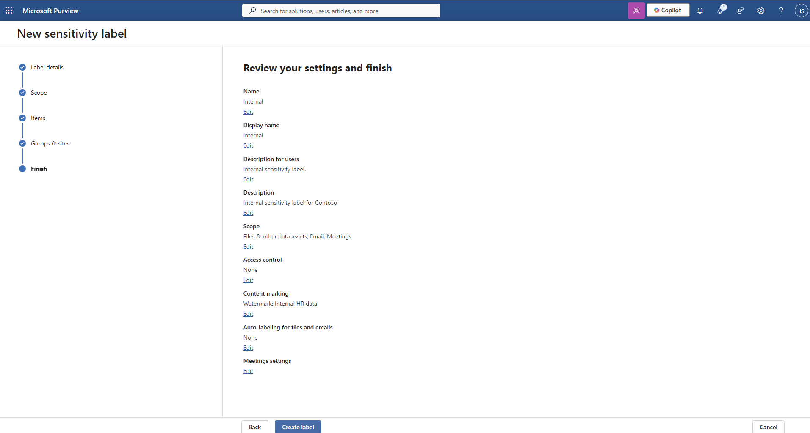

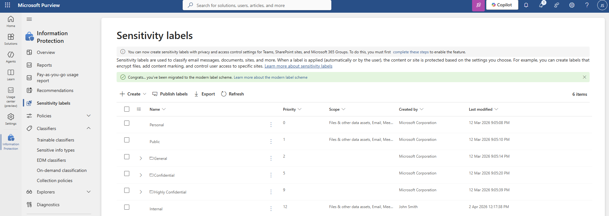

---

## 3.2 Auto-Labelling Policy

Configured auto-labelling rule to classify existing content automatically.

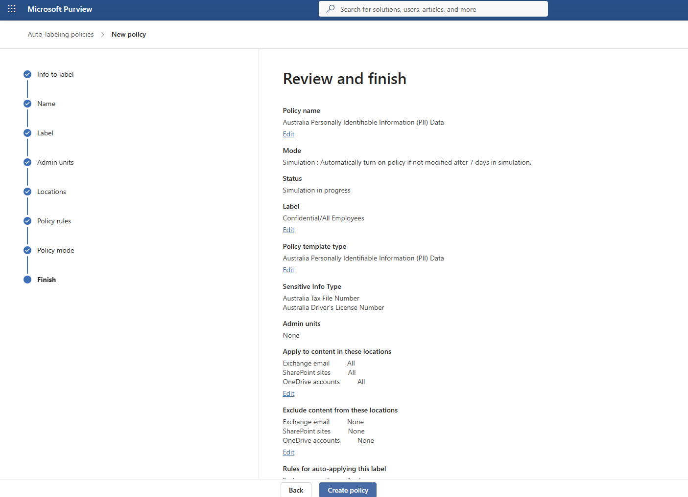

---

# Part 4 — Data Loss Prevention (DLP)

## 4.1 DLP Policy Creation

Created a DLP policy to prevent sensitive data exposure.

---

## 4.2 AI Data Protection Scenario

Configured policy to block uploading sensitive data to generative AI platforms.

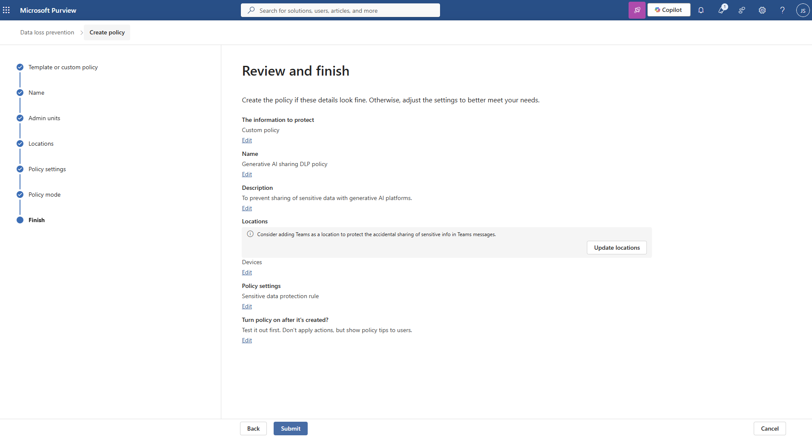

---

# Part 5 — Insider Risk Management

## 5.1 Insider Risk Settings

Enabled insider risk monitoring features.

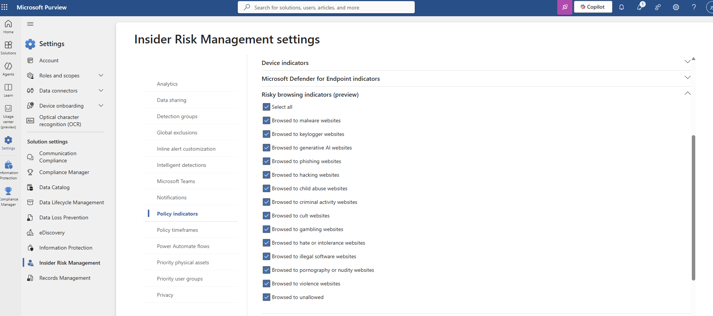

---

## 5.2 Insider Risk Policy

Created policy to detect risky user behaviour patterns.

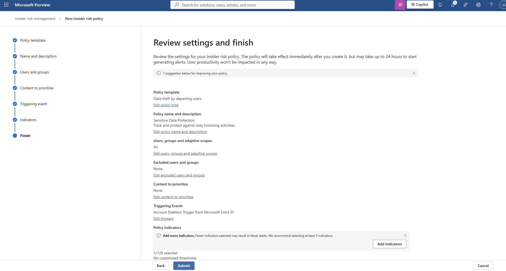

---

# Investigation Value

This lab demonstrates:

- Data classification and protection lifecycle  
- Prevention of sensitive data leakage  
- Monitoring of user behaviour risks  
- Integration of compliance controls into security operations  

---

# Skills Demonstrated

- Microsoft Purview configuration  
- Sensitive information type creation  
- Sensitivity labels & auto-labelling  
- Data Loss Prevention (DLP) policies  
- Insider Risk Management  
- Data security and compliance fundamentals  

---

## Disclaimer

All activities were performed in a **controlled lab environment using simulated data**.
